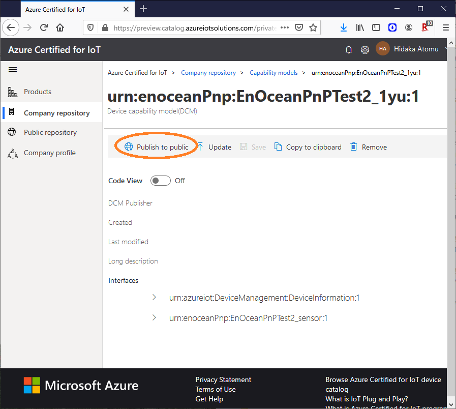

# IoT PnP デバイス・ファームウェア 開発手順

### IoT Central で sensor のテンプレートを作成
- これを、インターフェースファイルとして ダウンロードします。
- テンプレート作成後、インターフェースなどの作成したテンプレートの各サブ項目を表示させるページからダウンロード可能。モデルファイルとインターフェースファイルは別なためそれぞれ、ダウンロードする必要有り。

### SDK-C のclone
- clone するBranchに注意

### インターフェースとモデルをpublic 公開する場合
- 事前にアカウント作成が必要
- company or public
- companyだと、IoT PnP が動作しないらしいので、IoT PnP を試すなら public
    - Open Model Repo
    - Submit Files to Repo

## トラブル＆フォロー

現在まだ Preview 状態であることと、約１年前に発表されたプロジェクトで、ドキュメントやソースコード、ライブラリ、ツールの更新が完全でないこともあり、様々なトラブルがあります。

### Stub code Generate 時のオプション
sourceを選択します。CMake Linux のみを推奨します。当然ながらビルドはLinux環境だけになります。WSLは時間が無く、試していません。他の選択でも正常ビルド、正常動作するコードを出力させる方法があるのかもしれませんが、トラブルが多いためお勧めしません。

vcpkg.exe を使用する手順では、経験している限り次のトラブルのいずれかが発生して、結局はIoT Centralに接続できません。また、特定の環境でインストールしたLinux環境のiot-sdk であっても、以下と同種の問題が発生する場合があることを確認しています。その様な場合でも、別のマシン環境であれば全く同じ手順で、正常ビルド＆正常動作することを確認しています。

vcpkg.exe 利用などにより発生する問題（）
- ビルド時にエラーとなる
- アプリケーション起動でエラーとなる
- アプリケーション起動後に、テレメトリーがIoT Centralで表示されない。

### azure-iot-sdk のバージョン
必ず Generate Codeした時の README.md 記述の下記の手順に従って、public-preview-pnp-2019-08 ブランチを使用します。他のブランチやmasterでは、恐らく正常動作しないものと思われます。

```sh
git clone https://github.com/Azure/azure-iot-sdk-c --recursive -b public-preview-pnp-2019-08
```

### cmake 起動時のオプション
必ず Generate Codeした時の README.md 記述の下記の手順に従って、-Duse_prov_client=ON -Dhsm_type_symm_key:BOOL=ON オプションを付加します。他のオプションやオプション無しでは、恐らく正常動作しないものと思われます。

```sh
cmake .. -Duse_prov_client=ON -Dhsm_type_symm_key:BOOL=ON
```

### public リポジトリへの公開

自分で作成した model ファイルと interface ファイルを public リポジトリで公開する手順は、恐らくどこにも記載されていません。次の様にします。約半日調べたり試行錯誤してももわからなかったため、[matsujirushi 様](https://github.com/matsujirushi) に教えて頂きました。



### IoT Explorer の利用

https://github.com/Azure/azure-iot-explorer/issues/299
にも書きましたが、IoT Central 接続時には利用できないようです。

## ライセンス

MIT

© 2020 Atomu Hidaka, All rights reserved.

本コンテンツの著作権、および本コンテンツ中に出てくる商標権、団体名、ロゴ、製品、サービスなどはそれぞれ、各権利保有者に帰属します。
