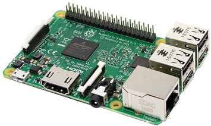
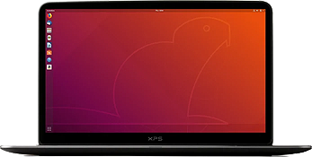
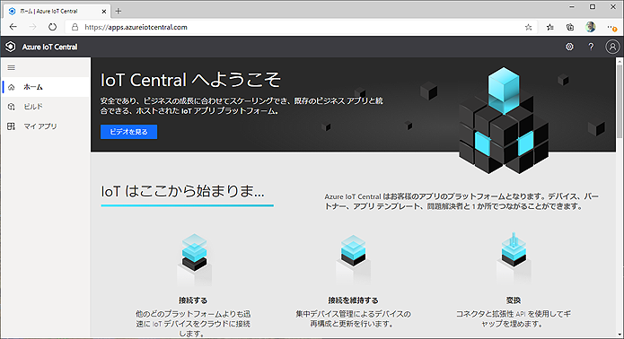
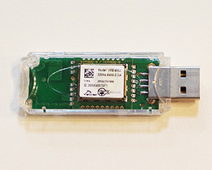
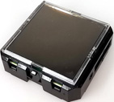
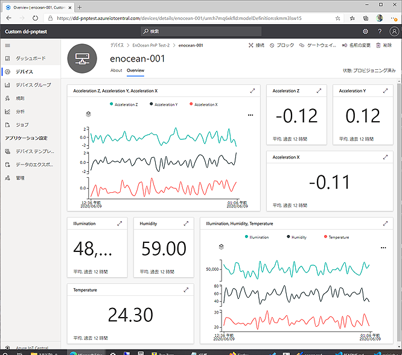

# EnOcean_IoTPnP

## EnOcean IoT Plug and Play (Preview)

#### [de:code 2020](https://www.microsoft.com/ja-jp/events/decode/2020/) [Microsoft MVP パーソナル スポンサー](https://www.microsoft.com/ja-jp/events/decode/2020/sponsor.aspx#primaryR10) 提供サンプルコード

### EnOceanマルチセンサー Azure IoT Plug and Play サンプル


## 概要
[2019年Build](https://news.microsoft.com/build2019/) で発表された [IoT Plug and Play Preview](https://azure.microsoft.com/en-us/blog/build-with-azure-iot-central-and-iot-plug-and-play/) の [EnOcean エネルギーハーベスティング マルチセンサー](https://www.enocean.com/en/products/enocean_modules_928mhz/stm-550j-multisensor-module/) と、[PC Linux (Ubuntu 18.04)](https://www.ubuntulinux.jp/) / [Raspberry pi](https://www.raspberrypi.org/) での実装サンプルコードと解説書です。次の内容を含みます。

- 温度、湿度、加速度、照度、開閉 の [EnOceanマルチセンサー](https://www.enocean.com/en/products/enocean_modules_928mhz/stm-550j-multisensor-module/)・インターフェースと [Azure IoT Central](https://azure.microsoft.com/ja-jp/services/iot-central/) 接続ゲートウェイのソースコードとバイナリーコード
- IoT Plug and Play、Azure IoT Central 動作確認用ツール（シミュレーター）の全コード
- EnOceanマルチセンサー動作確認用ツールの全コード（[別リポジトリ](https://github.com/ahidaka/EnOceanGateways/tree/master/DolphinRide)）
- ビルド手順、導入手順、注意点を示す日本語解説書。

シミュレータープログラムは、センサーやゲートウェイを必要とせず単体で動作するため、IoT Central と IoT Plug and Play 動作検証として利用できます。

このサンプルコードは2020年夏に [EnOcean Alliance](https://www.enocean-alliance.org/ja/) / [IoT ALGYAN](https://algyan.connpass.com/) で開催する オンライン・ハンズオン＋EnOcean開発コンテストの参考資料でもあります。

## ねらい
- Azure IoT Plug and Play(Preview) を汎用的プラットフォームでの実用的な実装事例を示すことで、早期評価と検証の機会を広げます。
- IoT Plug and Play (Preview) を5種類のセンサー内蔵、100m安定無線通信、AESセキュリティ付単価1万円程度の安価で小型高機能なEnOcean新製品のマルチセンサーに対応させることで、実用的なIoT機器として、評価・導入し易さを図ります。
- 直ぐにデータを可視化表示できる、分かり易く簡単導入可能な Azure IoT Central / IoT Plug and Play (Preview) への対応により、Azure IoT の導入のし易さを事例として示します。

## 動作に必要なもの
- Internet 接続のRaspberry Pi シリーズ マイコンボード または Ubuntu 18.04 が動作している x86_64 PC（必須）
- Azure IoT Central にアクセス可能なブラウザ搭載環境（Windows 10 + New Edge 推奨、必須）

 
##### Raspberry Pi 3 とUbuntu 18.04動作のPC 例
[ "Azure IoT Central"](image/iotc-top.png)
##### Azure IoT Central へのブラウザアクセス例

- [USB400J EnOcean USB ゲートウェイ](https://www.enocean.com/en/products/enocean_modules_928mhz/usb-400j/) または同等機能品（シミュレーター動作時は不要）


#####  USB400J

- [STM550J マルチセンサー](https://www.enocean.com/en/products/enocean_modules_928mhz/stm-550j-multisensor-module/) （シミュレーター動作時は不要）


##### STM550J

2020年6月末ごろ [e-kit.jp](http://e-kit.jp/) 等にて販売開始予定 

#### マルチセンサーのテレメトリー内容

| 機能 | EOGWポイント名 | iothub name | 型 | 表示単位 | 最小 | 最大 | 備考 |
| :-: | :-: | :-: | :-: | :-: | :-: | :-: | :-: |
| 温度センサー | TP | temperature | double | ℃ | -40 | 60 |  |
| 湿度センサー | HU | humidity | double | % | 0 | 100 |  |
| 照度センサー | IL | illumination | double | lux | 0 | 100000 |  |
| 加速度センサー状態 | AS | accelerations | enum | - | 0 | 3 | Periodic Update(0), Threshold 1 exceeded(1), Threshold 2 exceeded(2) |
| 加速度センサー(X) | AX | accelerationx | double | g | -2.5 | 2.5 |  |
| 加速度センサー(Y) | AY | accelerationy | double | g | -2.5 | 2.5 |  |
| 加速度センサー(Z) | AZ | accelerationz | double | g | -2.5 | 2.5 |  |
| 開閉センサー | CO | contact | enum | - | 0 | 1 | Open(0), Close(1) |

## サンプルバイナリーを動作させる手順

### シミュレーターでの動作

操作が容易なので、先にシミュレータープログラムを使った動作方法を説明します。

#### 参考文献
[Azure IoT Central アプリケーションの作成](https://docs.microsoft.com/ja-jp/azure/iot-central/core/quick-deploy-iot-central)

[チュートリアル:デバイス機能モデルを使用して IoT プラグ アンド プレイ (プレビュー) デバイスを作成し、IoT Central アプリケーションに接続する](https://docs.microsoft.com/ja-jp/azure/iot-central/core/tutorial-connect-pnp-device)

１．準備
- シミュレーターの入手とインストール

    アーキテクチャに応じたバイナリープログラムを以下からダウンロードして入手後、適当なディレクトリにコピーして下さい。
    - [Raspberry pi シリーズ simulatepnp/bin/armv7l/simulatepnp](simulatepnp/bin/armv7l/simulatepnp)
    - [Ubuntu 18.04 x86_64 PC simulatepnp/bin/x86_64/simulatepnp](simulatepnp/bin/x86_64/simulatepnp)

- dps-keygen のインストール
    Node.js をインストール後、下記コマンドを実行して **dps-keygen** を利用可能にしてください。
    ```sh
    npm i -g dps-keygen
    ```
    ■アドバイス：  
    dps-keygen コマンドは実行して結果の文字列が得られれば良いため、必ずしも前記シミュレータープログラムと同じ環境にインストールする必要はありません。

- IoT Central でのカスタム アプリケーション作成

    「カスタム アプリ」 > 「カスタム アプリケーション」 テンプレートを使用して、中身が空のカスタム アプリケーションを作成します。

２．デバイスキーの作成

[デバイス キーの生成](https://docs.microsoft.com/ja-jp/azure/iot-central/core/tutorial-connect-pnp-device#generate-device-key) 手順に従って、前項で作成した「カスタム アプリケーション」の
「管理」タブの「デバイス接続」ページで、
**このアプリの SAS トークン** の「キーの表示」をクリックして
「主キー」をコピーして保存します。

同じ **デバイス接続** 画面の **ID スコープ** は、後でアプリケーション起動時に使用するため、一時的にコピーして保存しておきます。


デバイス キーの生成
```sh
dps-keygen -di:enocean-001 -mk:{上記で入手した「主キー」}
```

di:パラメータで指定するデバイス名は、任意に設定可能です。
今回のサンプルはmxchipを使用しないので、変更するのであれば、enocean-001 とでもしてください。


３．実行

４．動作検証

iotcのデバイスを開きます。

[](image/iotc-sim1.png)

##### シミュレーター動作画面例

## 開発手順

### 事前に必要なソフトウェアの準備

[IoT PnP デバイス・ファームウェア 開発手順](Development.md)

Azure IoT Plug and Play (Preview) 対応デバイス側ソフトウェア（Linux）を開発する手順と注意点を示します。 

## 参考文献

### Azure IoT Plug and Play (Preview)

★matsujirusi 資料、ブログ

### EnOcean 製品
https://www.enocean.com/jp/products/enocean_modules_928mhz/stm-550j-multisensor-module/

https://www.enocean.com/jp/products/enocean_modules_928mhz/usb-400j/


## ライセンス

MIT

© 2020 Atomu Hidaka, All rights reserved.

本コンテンツの著作権、および本コンテンツ中に出てくる商標権、団体名、ロゴ、製品、サービスなどはそれぞれ、各権利保有者に帰属します。
