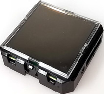
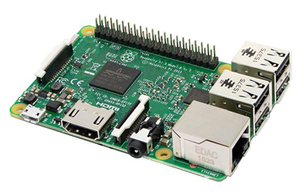
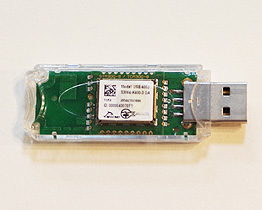
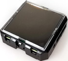

# EnOcean_IoTPnP

## EnOcean IoT Plug and Play

#### [de:code 2020](https://www.microsoft.com/ja-jp/events/decode/2020/) Microsoft MVP パーソナル スポンサー 提供サンプルコード

### EnOceanマルチセンサー Azure IoT Plug and Play サンプル

## 概要
[2019年Build](https://news.microsoft.com/build2019/) で発表された [IoT Plug and Play Preview](https://azure.microsoft.com/en-us/blog/build-with-azure-iot-central-and-iot-plug-and-play/) の [EnOceanエネルギーハーベスティングマルチセンサー](https://www.enocean.com/en/products/enocean_modules_928mhz/stm-550j-multisensor-module/) と、[PC Linux](https://www.ubuntulinux.jp/) / [Raspberry pi](https://www.raspberrypi.org/) での実装サンプルコードと解説書です。次の内容を含みます。

- 温度、湿度、加速度、照度、開閉の [EnOceanマルチセンサー](https://www.enocean.com/en/products/enocean_modules_928mhz/stm-550j-multisensor-module/)・インターフェースと [Azure IoT Central](https://azure.microsoft.com/ja-jp/services/iot-central/) 接続ゲートウェイの全コード
- EnOceanマルチセンサー、IoT Plug and Play、Azure IoT Central 動作確認用ツールの全コード
- 全ビルド手順、導入手順を示す日本語解説書。これは2020年夏に [EnOcean Alliance](https://www.enocean-alliance.org/ja/) / [IoT ALGYAN](https://algyan.connpass.com/) で開催する オンライン・ハンズオン＋EnOcean開発コンテストの参考資料でもあります。

## ねらい
- Azure IoT Plug and Playを汎用的プラットフォームで実用的な実装事例を示すことで、早期評価と検証の機会を広げます。
- IoT Plug and Playを5種類のセンサー内蔵、100m安定無線通信、AESセキュリティ付単価1万円程度の安価で小型高機能なEnOcean新製品のマルチセンサーに対応させることで、実用的なIoT機器として、評価・導入し易さを図ります。
- 簡単導入可能なAzure IoT Centralへの対応により、Azure IoTの導入のし易さを事例として示します。

## 動作に必要なもの
- Raspberry Pi シリーズ マイコンボード または Ubuntu 18.04 が動作している x86_64 PC

- [USB400J EnOcean USB ゲートウェイ](https://www.enocean.com/en/products/enocean_modules_928mhz/usb-400j/) または同等機能品

- [STM550J マルチセンサー](https://www.enocean.com/en/products/enocean_modules_928mhz/stm-550j-multisensor-module/) 

2020年6月末ごろ [e-kit.jp](http://e-kit.jp/) 等にて販売開始予定 

#### マルチセンサーのテレメトリー内容

| 機能 | EOGWポイント名 | iothub name | 型 | 表示単位 | 最小 | 最大 | 備考 |
| :-: | :-: | :-: | :-: | :-: | :-: | :-: | :-: |
| 温度センサー | TP | temperature | double | ℃ | -40 | 60 |  |
| 湿度センサー | HU | humidity | double | % | 0 | 100 |  |
| 照度センサー | IL | illumination | double | lux | 0 | 100000 |  |
| 加速度センサー状態 | AS | accelerations | enum | - | 0 | 3 | Periodic Update(0), Threshold 1 exceeded(1), Threshold 2 exceeded(2) |
| 加速度センサー(X) | AX | accelerationx | double | g | -2.5 | 2.5 |  |
| 加速度センサー(Y) | AY | accelerationy | double | g | -2.5 | 2.5 |  |
| 加速度センサー(Z) | AZ | accelerationz | double | g | -2.5 | 2.5 |  |
| 開閉センサー | CO | contact | enum | - | 0 | 1 | Open(0), Close(1) |

## サンプルバイナリーを動作させる手順

#### ★シミュレーターの件

### Raspberry pi シリーズ

### Ubuntu 18.04 搭載 PC

## 開発手順

### 事前に必要なソフトウェアの準備

[IoT PnP デバイス・ファームウェア 開発手順](Development.md)

Azure IoT Plug and Play (Preview) 対応デバイス側ソフトウェア（Linux）を開発する手順と注意点を示します。 

## 参考文献

### Azure IoT Plug and Play (Preview)

★matsujirusi 資料、ブログ

### EnOcean 製品
https://www.enocean.com/jp/products/enocean_modules_928mhz/stm-550j-multisensor-module/

https://www.enocean.com/jp/products/enocean_modules_928mhz/usb-400j/

## ライセンス

MIT

© 2020 Atomu Hidaka, All rights reserved.

本コンテンツの著作権、および本コンテンツ中に出てくる商標権、団体名、ロゴ、製品、サービスなどはそれぞれ、各権利保有者に帰属します。
