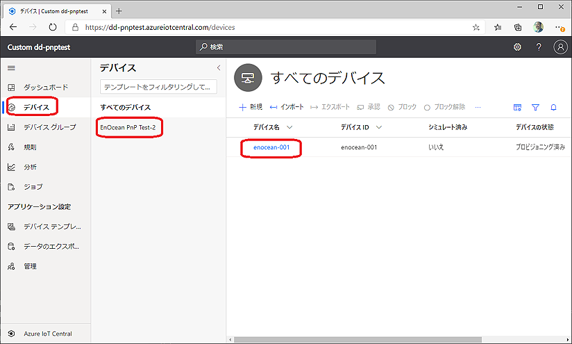
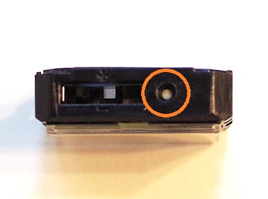

# EnOcean_IoTPnP

## EnOcean IoT Plug and Play

#### [Microsoft Build 2021](https://mybuild.microsoft.com/home) Microsoft MVP パーソナル スポンサー 提供サンプルコード

### EnOceanマルチセンサー Azure IoT Plug and Play サンプル


##### 写真：EnOceanマルチセンサー STM550J

## 概要
[Azure IoT Plug and Play](https://docs.microsoft.com/ja-jp/azure/iot-pnp/overview-iot-plug-and-play?WT.mc_id=IoT-MVP-35878) の [EnOcean エネルギーハーベスティング マルチセンサー](https://www.enocean.com/en/products/enocean_modules_928mhz/stm-550j-multisensor-module/) と、[PC Linux (Ubuntu 18.04)](https://www.ubuntulinux.jp/) / [Raspberry pi](https://www.raspberrypi.org/) での実装サンプルコードと解説書です。
以前は同じページで、Azure IoT Plug and Play (Preview) 用のサンプルを公開していましたが、[Azure IoT Plug and Play](https://docs.microsoft.com/ja-jp/azure/iot-pnp/?WT.mc_id=IoT-MVP-35878) のGAにより、[DTDL V2](https://docs.microsoft.com/ja-jp/azure/digital-twins/concepts-models?WT.mc_id=IoT-MVP-35878) と[Azure IoT Cenrtral V3](https://docs.microsoft.com/ja-jp/azure/iot-central/core/howto-migrate) に対応させました。次の内容を含みます。

- 温度、湿度、加速度、照度、開閉 の [EnOceanマルチセンサー](https://www.enocean.com/en/products/enocean_modules_928mhz/stm-550j-multisensor-module/)・インターフェースと [Azure IoT Central](https://azure.microsoft.com/ja-jp/services/iot-central/) 接続ゲートウェイのソースコードとバイナリーコード
- IoT Plug and Play、Azure IoT Central 動作確認用ツール（シミュレーター）の全コード
- EnOceanマルチセンサー動作確認用ツールの全コード（[別リポジトリ](https://github.com/ahidaka/EnOceanGateways/tree/master/DolphinRide)）
- ビルド手順、導入手順、注意点を示す日本語解説書。

ここに掲載のシミュレーター プログラムは、センサーやゲートウェイを必要とせず単体で動作するため、IoT Central と IoT Plug and Play 動作検証として利用できます。

このサンプルコードは2020年夏に [EnOcean Alliance](https://www.enocean-alliance.org/ja/) / [IoT ALGYAN](https://algyan.connpass.com/) で開催する オンライン・ハンズオン＋EnOcean開発コンテストの参考資料でもあります。

## ねらい
- Azure IoT Plug and Play(Preview) を汎用的プラットフォームでの実用的な実装事例を示すことで、早期評価と検証の機会を広げます。
- IoT Plug and Play (Preview) を5種類のセンサー内蔵、100m安定無線通信、AESセキュリティ付単価1万円程度の安価で小型高機能なEnOcean新製品のマルチセンサーに対応させることで、実用的なIoT機器として、評価・導入し易さを図ります。
- 直ぐにデータを可視化表示できる、分かり易く簡単導入可能な Azure IoT Central / IoT Plug and Play (Preview) への対応により、Azure IoT の導入のし易さを事例として示します。

## 動作に必要なもの
- Internet 接続のRaspberry Pi シリーズ マイコンボード または Ubuntu 18.04 が動作している x86_64 PC（必須）

     
    
    ##### 写真：Raspberry Pi 3 とUbuntu 18.04動作のPC 例

- Azure IoT Central にアクセス可能なブラウザ搭載環境（Windows 10 + New Edge 推奨、必須）

    [](image/iotc-top.png)
    ##### 写真：Azure IoT Central へのブラウザアクセス例

- [USB400J EnOcean USB ゲートウェイ](https://www.enocean.com/en/products/enocean_modules_928mhz/usb-400j/) または同等機能品（シミュレーター動作時は不要）

    
    ##### 写真：USB400J

    [e-kit.jp](http://e-kit.jp/) にて販売中。[STM550J とのセット販売](http://e-kit.jp/products/EnOcean/STM550JSET) も有り。 

- [STM550J マルチセンサー](https://www.enocean.com/en/products/enocean_modules_928mhz/stm-550j-multisensor-module/) （シミュレーター動作時は不要）

    
    ##### 写真：STM550J

    [e-kit.jp](http://e-kit.jp/) にて予約販売受付中。 

#### マルチセンサーのテレメトリー内容

| 機能 | EOGWポイント名 | iothub name | 型 | 表示単位 | 最小 | 最大 | 備考 |
| :-: | :-: | :-: | :-: | :-: | :-: | :-: | :-: |
| 温度センサー | TP | temperature | double | ℃ | -40 | 60 |  |
| 湿度センサー | HU | humidity | double | % | 0 | 100 |  |
| 照度センサー | IL | illumination | double | lux | 0 | 100000 |  |
| 加速度センサー状態 | AS | accelerations | enum | - | 0 | 3 | Periodic Update(0), Threshold 1 exceeded(1), Threshold 2 exceeded(2) |
| 加速度センサー(X) | AX | accelerationx | double | g | -2.5 | 2.5 |  |
| 加速度センサー(Y) | AY | accelerationy | double | g | -2.5 | 2.5 |  |
| 加速度センサー(Z) | AZ | accelerationz | double | g | -2.5 | 2.5 |  |
| 開閉センサー | CO | contact | enum | - | 0 | 1 | Open(0), Close(1) |


- ■アドバイス：<br/>
    これらのテレメトリーは、NFC付スマートフォンの [EnOcean tool](https://www.enocean.com/en/products/enocean-software/enocean-tool/) で容易に設定変更ができます。[設定解説ビデオはこちら](https://www.youtube.com/watch?v=24BFDGHja9c)。

## サンプルバイナリーを動作させる手順

### シミュレーターでの動作

手順が簡単のため、先にシミュレーター プログラムを使った動作方法を説明します。

#### 参考文献
[Azure IoT Central アプリケーションの作成](https://docs.microsoft.com/ja-jp/azure/iot-central/core/quick-deploy-iot-central)

[チュートリアル:デバイス機能モデルを使用して IoT プラグ アンド プレイ (プレビュー) デバイスを作成し、IoT Central アプリケーションに接続する](https://docs.microsoft.com/ja-jp/azure/iot-central/core/tutorial-connect-pnp-device)

[Azure IoT Central 専用 Azure サブスクリプション作成方法](https://github.com/ahidaka/azure-subscription)

１．準備
- シミュレーターの入手とインストール

    実行環境のアーキテクチャに応じたバイナリープログラムを以下からダウンロードして入手後、適当なディレクトリにコピーして下さい。コピーするだけで、インストールは完了です。
    - Raspberry pi シリーズ
 
        [simulatepnp/bin/armv7l/simulatepnp](simulatepnp/bin/armv7l/simulatepnp)

    - Ubuntu 18.04 x86_64 PC

        [simulatepnp/bin/x86_64/simulatepnp](simulatepnp/bin/x86_64/simulatepnp)

- dps-keygen のインストール
    
    Node.js をインストール後、下記コマンドを実行して **dps-keygen** を利用可能にしてください。
    ```sh
    npm i -g dps-keygen
    ```
 
- ■アドバイス：<br/>
    dps-keygen コマンドは実行して結果の文字列が得られれば良いため、必ずしも前記シミュレータープログラムと同じ環境にインストールする必要はありません。

- IoT Central でのカスタム アプリケーション作成方法

   [「Azure IoT Central アプリケーションの作成」](https://docs.microsoft.com/ja-jp/azure/iot-central/core/quick-deploy-iot-central)手順に従って、
    「カスタム アプリ」 > 「カスタム アプリケーション」 テンプレートを使用して、中身が空のカスタム アプリケーションを作成します。

２．デバイスキーの作成

[デバイス キーの生成](https://docs.microsoft.com/ja-jp/azure/iot-central/core/tutorial-connect-pnp-device#generate-device-key) 手順に従って、
前項で作成した「カスタム アプリケーション」の「管理」タブの「デバイス接続」ページで、
**このアプリの SAS トークン** の「キーの表示」をクリックして
「主キー」をコピーして保存します。

同じ **デバイス接続** 画面の **ID スコープ** は、後でアプリケーション起動時に使用するため、一時的にコピーして保存しておきます。

次に示すように dps-keygen コマンドを実行して生成・表示された デバイス キー をメモしておきます。
表示されたこの値は、後でアプリケーション起動時に使用します。

##### デバイス キーの生成 コマンド
```sh
dps-keygen -di:enocean-001 -mk:{上記で入手した「主キー」}
```

di:パラメータで指定する デバイス ID は、任意に設定可能です。今回のサンプルは前記参考手順とは異なり、mxchipを使用しないため、enocean-001 としています。このキー生成に使用したデバイス名も、後でアプリケーション起動時に使用するため、保存しておきます。

３．実行
実行は、次の通りコピーしたバイナリープログラムを Linux shell から起動するだけです。ビルドは必要ありません。実行後、画面にはたくさんのログメッセージが表示されます。

```sh
./simulatepnp [デバイス ID] [ID スコープ] [デバイス キー]
```

#### 例

```sh
./simulatepnp enocean-001 0ne0010FFFF 1rmxGaeTzBsCarlTaxyzOL9XXXXXXXXXXXXXXXXwOUg=
```

４．動作検証

前項１．で作成したアプリケーションのデバイス画面を開きます。前項でのプログラムの実行後、Plug and Play 動作でテンプレートとデバイスが自動作成されるには、30秒程度の時間がかかるため、少し待ちます。やがて、下記画面例の様に「デバイス」>「すべてデバイス」に「EnOcean PnP Test-2」のテンプレート名が現れ、その下に前項のシミュレーター プログラム起動時に指定した「デバイス ID」（この例では enocean-001 ）が表示されます。

[](image/iotc-device.png)

##### 画面：すべてデバイスでの デバイス ID 表示

この画面で作成した「デバイスID」（この例では enocean-001 ）をクリックして「デバイス情報画面」を表示させます。さらに30秒程度待つと、自動的に生成されたグラムやデバイス情報画面での描画が始まります。

ソースコード（[simulatepnp/EnOceanPnPTest2_1yu_impl.c](simulatepnp/EnOceanPnPTest2_1yu_impl.c)）を見ると分かる通り、テレメトリーの値はシミュレーター プログラム用に、乱数で生成しています。テレメトリーの送信間隔は 2秒 に設定しています。

[](image/iotc-sim1.png)

##### 画面：シミュレーター動作画面例

５．動作終了

起動した Linux Shell 画面で、「Control-C」 を入力してシミュレーター プログラムを終了します。

### 実機での動作

実機での動作は、EnOceanゲートウェイプログラムをインストールして設定、実行する以外は、前項 **シミュレーターでの動作** と同じです。また使用する IoT Central のアプリケーションや **デバイス ID**、**デバイス キー** も流用可能です。従って事前にトラブルを避けるためにも、前項の「シミュレーターでの動作」の項を一度実行して、試しておくことをお勧めします。

１．準備
- 動作プログラムの入手とインストール

    実行環境のアーキテクチャに応じたバイナリープログラムを以下からダウンロードして入手後、適当なディレクトリにコピーして下さい。プログラムは実機動作プログラムと、EnOcean ゲートウェイプログラムの2種類があります。コピーするだけでインストールは完了です。
    - Raspberry pi シリーズ
 
        [enoceanpnp/bin/armv7l/enoceanpnp](enoceanpnp/bin/armv7l/enoceanpnp)

        [enoceanpnp/bin/armv7l/dpride](enoceanpnp/bin/armv7l/dpride)

    - Ubuntu 18.04 x86_64 PC

        [enoceanpnp/bin/x86_64/enoceanpnp](enoceanpnp/bin/x86_64/enoceanpnp)

        [enoceanpnp/bin/x86_64/dpride](enoceanpnp/bin/x86_64/dpride)

- dps-keygen のインストール
    前項と同様です。すでにインストールしてあれば再インストールは不要です。

- IoT Central でのカスタム アプリケーション作成
    前項と同様です。すでに作成してある場合、同じアプリケーションが利用可能です。

- 機材の準備
    STM550J と USB400J（または同等品）を用意してください。USB400J は動作環境マシンに装着します。
    Windows PC を使用して、EnOcean Dolphin View Advance ツールを使用して同様確認をしておきます。

- ■アドバイス：<br/>
    EnOcean Dolphin View Advance アプリケーションは、EnOcean GmbH の [開発ツールダウンロードページ](https://www.enocean.com/en/support/download/) から入手します。

    最新版は以下の3.8.6.0 です。入手にはメールアドレスによるアカウント登録が必要です。
    https://www.enocean.com/en/support/download/dolphinview-advanced/DolphinViewAdvanced3_8_6_0.exe/

    EnOcean ゲートウェイ プログラム は以下の別リポジトリにあります。
    
    [EnOceanGateways リポジトリ](https://github.com/ahidaka/EnOceanGateways)


２．デバイスキーの作成

デバイスキーの生成手順は、前項の手順と同じです。また、前項で作成した デバイス ID やデバイスキー を流用することも可能ですし、今回例えば デバイス ID を **enocean-002** 等として、新たに作成して使用することも可能です。

３．センサー登録

動作環境にインストールした EnOcean ゲートウェイ プログラム(dpride)を、次のオプションで「センサー登録モード」起動して、マルチセンサーを動作環境に登録します。

```sh
sudo ./dpride -c -r
```

- ■アドバイス：<br/>
    USB等のデバイスIOポートにアクセスするため、管理者権限で実行します。<br/>
    初出時、"sudo" が抜けいました。申し訳ございません。

その後マルチセンサーの **LEARNボタン** を押して、デバイス登録を完了します。
起動画面にデバイス登録済のメッセージが出力されます。



- ■アドバイス：<br/>
    LEARNボタンは奥まった場所にあるので、クリップの先などで押します。

登録完了後は、「Control-C」で ゲートウェイ プログラムを一旦終了します。

４．実行

先にEnOcean ゲートウェイ プログラム (dpride) をオペレーション モードで起動します。
```sh
./dpride -o
```
次に別の Shell画面を開いて、Plug and Play 実行プログラムを起動します。
各プログラムをバックグラウンドで実行することも可能ですが、それぞれ起動画面に動作状況ログを出力するのと、ともに「Control-C」で停止させることから、別画面で起動した方が使い勝手が良いです。
```sh
./enoceanpnp [デバイス ID] [ID スコープ] [デバイス キー]
```

#### 例

```sh
./enoceanpnp enocean-002 0ne0010FFFF 1rmxGaeTzBsCarlTaxyzOL9XXXXXXXXXXXXXXXXwOUg=
```

５．動作検証

動作検証も基本的には、前項のシミュレーターの場合と同じです。起動時に指定した デバイスID を指定して、IoT Central のデバイス情報表示画面で確認可能です。加速度センサーや開閉センサーは、ほぼ即時にセンサーデータを送信するため、ほぼリアルタイムでの動作確認ができます。

６．動作終了

dpride enoceanpnp ともに「Control-C」 を入力してシミュレーター プログラムを終了します。

## 開発手順

### 事前に必要なソフトウェアの準備

様々な環境を試しましたが、今回の開発では Windows 上で VS Code を使用しています。

### 概要

開発は次の3ステップで行います。
- IoT PnP コードの生成(Generate)
- IoT PnP コードの修正
- IoT PnP コードのビルド

基本的には、前項でも紹介した下記の手順に従いますが、この手順は mx-chip 向けなのと、いくつかの不具合があるため、IoT PnP コードの生成(Generate) だけをこの手順通りにWindows 上で VS Code を使用して行い、コードの修正とビルドはターゲットのLinux環境上で行います。

[チュートリアル:デバイス機能モデルを使用して IoT プラグ アンド プレイ (プレビュー) デバイスを作成し、IoT Central アプリケーションに接続する](
https://docs.microsoft.com/ja-jp/azure/iot-central/core/tutorial-connect-pnp-device)

### 詳細

前記手順による開発の詳細と注意点、アドバイス等は下記にまとめています。

[IoT PnP デバイス・ファームウェア 開発手順](Development.md)


## 参考文献

### Azure IoT Plug and Play (Preview)

IoT Plug and Play の実装方法（松岡様提供）
https://www.slideshare.net/TakashiMatsuoka2/iot-plug-and-play/

### EnOcean 製品
https://www.enocean.com/jp/products/enocean_modules_928mhz/stm-550j-multisensor-module/

https://www.enocean.com/jp/products/enocean_modules_928mhz/usb-400j/

## ライセンス

MIT

© 2020 Atomu Hidaka, All rights reserved.

本コンテンツの著作権、および本コンテンツ中に出てくる商標権、団体名、ロゴ、製品、サービスなどはそれぞれ、各権利保有者に帰属します。
